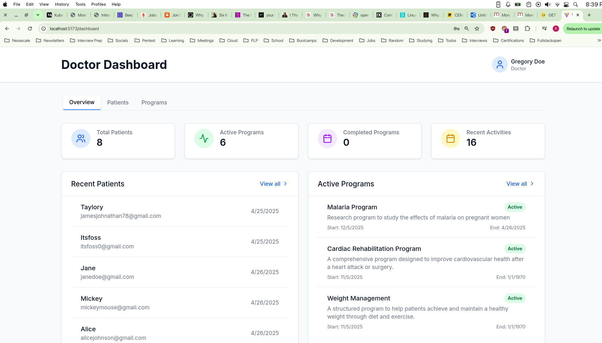

# HEALTH HUB


Healthhub is a health information management system running on the web. It allows doctors to create and manage programs and patients. A doctor registers an account, verifies their profile and create programs, add patients to the programs and manage them. You can checkout a demo of the product [here](https://drive.google.com/file/d/1GLK6vQaFT7othYx6we86Kin4WRFunFFB/view?usp=sharing)



## System Design

**Let's see how the sytem is built**

The application has been built with the following technologies: React on the frontend, MongoDB database, Express for the API running on NodeJS

**API Spec**

You can checkout the complete API from this [postman collection](https://www.postman.com/solar-moon-19696-1/workspace/healthhub/collection/30656741-0992fb47-4f11-46c2-a71f-8227daaa1f99?action=share&creator=30656741)

On a high level, the API has the following Endpoints with the allowed method and Access Mechanism

### API Documentation

#### Authentication

The API uses two main authentication methods:

- **Bearer Token**: For endpoints requiring user authentication
- **HTTP Only Cookie**: For token refresh operations

#### Base URL

All endpoints are prefixed with: `/api/version/`

#### Endpoints

#### Status

#### `GET /api/v1/status`

- **Authentication**: None
- **Description**: Probes the API to check if it's running
- **Response**: Status of the API

#### Authentication

#### `POST /api/v1/auth/login`

- **Authentication**: None
- **Description**: Authenticates a user and provides token pairs
- **Request Body**:
  ```json
  {
    "email": "string",
    "password": "string",
    "loginAs": "string"
  }
  ```
- **Response**: Authentication tokens

#### `POST /api/v1/auth/token/refresh`

- **Authentication**: HTTP Only Cookie (refreshToken)
- **Description**: Refreshes an expired access token (15 minutes validity)
- **Cookie**: `refreshToken=somerefreshtokenval`
- **Response**: New access token

#### `POST /api/v1/auth/verify/:doctorId`

- **Authentication**: None
- **Description**: Verifies a doctor's account
- **Parameters**: `?token=someverificationtoken`
- **Response**: Verification status

#### `POST /api/v1/auth/password/forgot`

- **Authentication**: None
- **Description**: Initiates password reset process
- **Request Body**:
  ```json
  {
    "email": "string",
    "accountType": "string"
  }
  ```
- **Response**: Password reset instructions

#### `GET /api/v1/auth/password/:userId`

- **Authentication**: None
- **Description**: Checks if password can be updated
- **Parameters**: `?token=sometoken`
- **Response**: Password update eligibility status

#### `POST /api/v1/auth/password/:userId/reset`

- **Authentication**: None
- **Description**: Resets password for specific user
- **Request Body**: New password information
- **Response**: Password reset confirmation

#### Doctors

#### `POST /api/v1/doctors`

- **Authentication**: None
- **Description**: Registers a new doctor
- **Request Body**:
  ```json
  {
    "email": "string",
    "firstName": "string",
    "lastName": "string",
    "password": "string",
    "phoneNumber": "string"
  }
  ```
- **Response**: New doctor details

#### `GET /api/v1/doctors`

- **Authentication**: Bearer Token
- **Description**: Lists all doctors
- **Parameters**:
  - `populatePatients=true|false`
  - `isActive=true|false`
  - `verified=true|false`
- **Response**: List of doctors

#### `GET /api/v1/doctors/:doctorId`

- **Authentication**: Bearer Token
- **Description**: Retrieves a specific doctor's details
- **Parameters**: `populatePatients=true|false`
- **Response**: Doctor details

#### `PUT /api/v1/doctors/:doctorId`

- **Authentication**: Bearer Token
- **Description**: Updates a doctor's details
- **Access**: Limited to the actual doctor
- **Request Body**: Updated doctor information
- **Response**: Updated doctor details

#### `DELETE /api/v1/doctors/:doctorId`

- **Authentication**: Bearer Token
- **Description**: Deletes a doctor's profile
- **Access**: Limited to the actual doctor
- **Response**: Deletion confirmation

#### Patients

#### `POST /api/v1/patients`

- **Authentication**: Bearer Token
- **Description**: Registers a new patient (only doctors can register patients)
- **Access**: Doctors only
- **Request Body**:
  ```json
  {
    "firstName": "string",
    "lastName": "string",
    "dateOfBirth": "string",
    "gender": "string",
    "phoneNumber": "string"
  }
  ```
- **Response**: New patient details with randomly assigned password

#### `GET /api/v1/patients`

- **Authentication**: Bearer Token
- **Description**: Lists all patients with filtering options
- **Access**: Doctors only
- **Parameters**:
  - `isActive=true|false`
  - `doctorId=doctor`
  - `populateDoctors=true|false`
  - `populatePrograms=true|false`
- **Response**: List of patients

#### `GET /api/v1/patients/:patientId`

- **Authentication**: Bearer Token
- **Description**: Retrieves a specific patient's details
- **Access**: Doctors only
- **Parameters**:
  - `doctor=true|false`
  - `programs=true|false`
- **Response**: Patient details

#### `PUT /api/v1/patients/:patientId`

- **Authentication**: Bearer Token
- **Description**: Updates a patient's details
- **Access**: Doctor and the actual patient only
- **Request Body**: Updated patient information
- **Response**: Updated patient details

#### `POST /api/v1/patients/:patientId/password`

- **Authentication**: Bearer Token
- **Description**: Updates a patient's password
- **Access**: Only the actual patient
- **Request Body**:
  ```json
  {
    "currentPassword": "string",
    "newPassword": "string"
  }
  ```
- **Response**: Password update confirmation

#### `DELETE /api/v1/patients/:patientId`

- **Authentication**: Bearer Token
- **Description**: Soft deletes a patient
- **Access**: Doctor and actual patient
- **Response**: Deletion confirmation

#### `POST /api/v1/patients/:patientId/doctors`

- **Authentication**: Bearer Token
- **Description**: Assigns a doctor to a patient
- **Access**: Doctors only
- **Request Body**:
  ```json
  {
    "doctorId": "string"
  }
  ```
- **Response**: Assignment confirmation

#### `DELETE /api/v1/patients/:patientId/doctors/:doctorId`

- **Authentication**: Bearer Token
- **Description**: Removes a doctor from a patient
- **Access**: Doctors only
- **Response**: Removal confirmation

#### Programs

#### `POST /api/v1/programs`

- **Authentication**: Bearer Token
- **Description**: Creates a new program
- **Access**: Doctors only
- **Request Body**:
  ```json
  {
    "name": "string",
    "description": "string",
    "type": "string",
    "capacity": "number",
    "startDate": "date"
  }
  ```
- **Response**: New program details

#### `GET /api/v1/programs`

- **Authentication**: Bearer Token
- **Description**: Lists all available programs
- **Access**: Doctors only
- **Parameters**:
  - `isActive=true|false`
  - `type=sometype`
  - `hasCapacity=number`
- **Response**: List of programs

#### `GET /api/v1/programs/:programId`

- **Authentication**: Bearer Token
- **Description**: Retrieves details of a specific program
- **Access**: Doctors only
- **Parameters**:
  - `coordinator=true|false`
  - `participants=true|false`
- **Response**: Program details

#### `PUT /api/v1/programs/:programId`

- **Authentication**: Bearer Token
- **Description**: Updates program details
- **Access**: Only the doctor who created the program
- **Request Body**:
  ```json
  {
    "name": "string",
    "description": "string",
    "type": "string",
    "capacity": "number",
    "isActive": "boolean",
    "startDate": "date",
    "endDate": "date"
  }
  ```
- **Response**: Updated program details

#### `DELETE /api/v1/programs/:programId`

- **Authentication**: Bearer Token
- **Description**: Deletes a program
- **Access**: Only the doctor who created the program
- **Response**: Deletion confirmation

#### `POST /api/v1/programs/:programId/participants`

- **Authentication**: Bearer Token
- **Description**: Adds patients to a program
- **Access**: Doctors only
- **Request Body**:
  ```json
  {
    "patientId": "string"
  }
  ```
- **Response**: Participant addition confirmation

#### `PUT /api/v1/programs/:programId/participants/:patientId`

- **Authentication**: Bearer Token
- **Description**: Updates participant details or adds notes about progress
- **Access**: Doctors only
- **Request Body**:
  ```json
  {
    "status": "string",
    "notes": "string"
  }
  ```
- **Response**: Updated participant details

#### `DELETE /api/v1/programs/:programId/participants/:patientId`

- **Authentication**: Bearer Token
- **Description**: Removes a patient from a program
- **Access**: Doctors only
- **Parameters**: `forceRemove=true|false`
- **Response**: Removal confirmation

#### `GET /api/v1/programs/:programId/stats`

- **Authentication**: Bearer Token
- **Description**: Retrieves statistics about a program
- **Access**: Doctors only
- **Response**: Program statistics


# Installatation and setup

To run the system locally, this repo and install the required dependencies

```
git clone https://github.com/Itsfoss0/healthhub
```

Install backend dependencies

```
cd healthhub/backend
```

```
npm install
```

Create a `.env` file and add keys for the following values. If you don't have a brevo account, make sure to create one and get your API key from the developer portal

```
touch .env

```

```env
MONGO_URI=yourmongourl
JWT_SECRET=06baecb92afd2c623f29f26a280a19a0
BREVO_API_KEY=yourbrevoapikey
CLIENT_URL=http://localhost:3000
ACCESS_TOKEN_SECRET=5b2543ebfcc1de621593081c8b00a5f1
REFRESH_TOKEN_SECRET=e76f3b43117fd5262cbc4e83cd1afbe1
PORT=5000
REFRESH_TOKEN_VALID_FOR=7d
ACESS_TOKEN_VALID_FOR=30m
```

Run the API with then `npm run dev` command

Install dependencies on the frontend and `npm run dev` as well.

If you used a port other that `5000` you will have to edit the same on the `BASE_URL` in the frontend services, so that the frontend knows where it can find the backend.

That's it for this one, thanks for coming to my TED talk.
